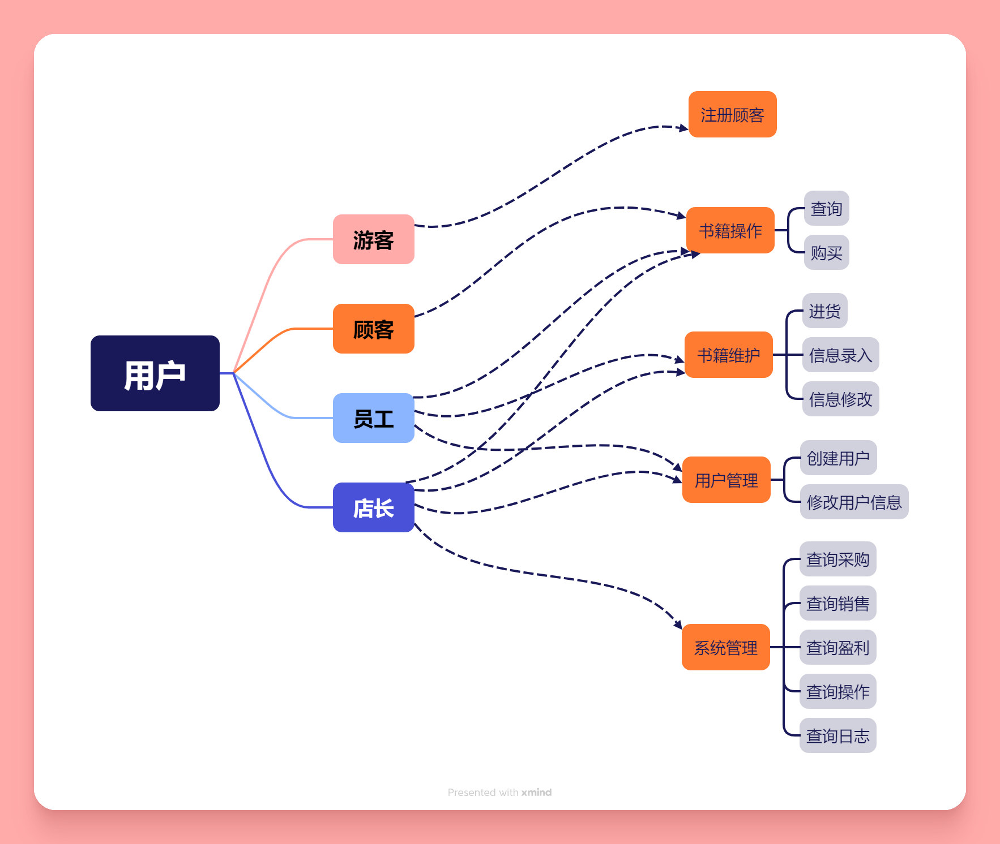

# 总体设计文档

## 功能设计

分为 **用户模块**、**书籍管理模块**、**日志模块**，以上三大模块基于一个 **数据库模块**，初步考虑用*块状链表*实现，或许会写 B+ 树。

### 用户模块

记录用户信息，执行用户操作：

- 登录
- 注册用户
- 修改用户信息
- 删除用户

用户信息有：

- 用户名（主键）
- 密码
- 用户权限 （决定他可以操作的指令）

### 书籍管理模块

记录书籍信息，执行书籍操作：

- 修改/添加书籍信息
- 删除书籍
- 进货（修改书籍数量）
- 查询
- 购买

书籍信息有：

- ISBN（主键）
- 书名
- 作者
- 出版社
- 出版日期
- 价格
- 库存数量

### 日志模块

记录用户操作，执行日志操作：

- 查询全部日志
- 查询某个用户的操作日志
- 查询某本书的操作日志

日志信息有：

- 日志编号（主键）
- 操作用户
- 操作时间
- 操作内容

## 用户交互设计

### 命令行界面

- `login [username]` 登录用户
- `logout` 退出登录
- `register [username] [password] [level]` 注册用户

以下命令仅在登录状态下可用，且根据当前登录用户权限判断是否允许执行。

- `book add [ISBN] [name] [author] [publisher] [date] [price] [quantity]` 添加书籍
- `book modify [ISBN] [name] [author] [publisher] [date] [price] [quantity]` 修改书籍信息
- `book import [ISBN] [quantity]` 进货
- `book search ISBN|name|author [ISBN|name|author]` 查询书籍
- `book buy [ISBN] [quantity]` 购买书籍

- `user modify [username] [password] [level]` 修改用户信息

- `log show [username]` 查询用户操作日志
- `log show [ISBN]` 查询书籍操作日志
- `log show` 查询全部操作日志

### Web 前端

🚧 待定.

## 数据库设计

使用时，抽象成一个二维表，包含用户表，日志表，书籍表。

每条记录包含若干键和值，其中有且仅有一个主键作为唯一标识。可以按键查询记录，可以按照主键修改记录（主键不能修改）。

### 底层实现

由若干 key2value 的键值对数据库构成，由块状链表实现。

对于一个数据表，建立 **[主键]-[记录]** 的映射和 **[辅键]-[主键]** 的映射。

查询时，先根据辅键找到主键，再根据主键找到记录。

修改时，先根据辅键找到主键，再根据主键修改记录，根据情况需要更新 **[辅键]-[主键]** 的映射。

## 类、结构体设计

数据库类；
用户类，书籍类，日志类；
登录管理类，命令管理类（用于检查命令合法），运行维护类(用于实现命令行交换)。
